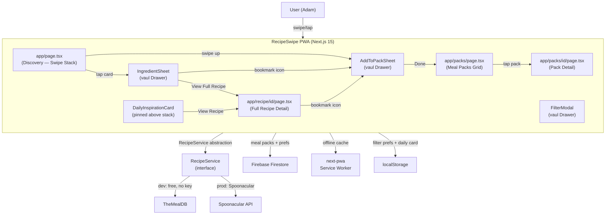
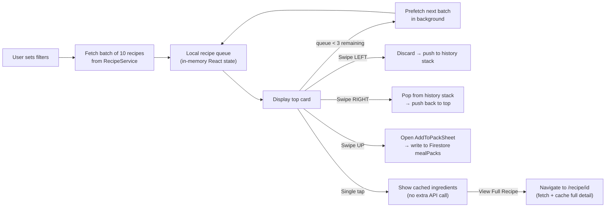

# RecipeSwipe — System Design & Architecture Plan (Web PWA)

## Platform Decision: Next.js PWA (not React Native)

Converted from Expo to a **Next.js 15 Progressive Web App** — identical stack to Smart Split.
Benefits:
- Installable on iOS and Android home screen via browser "Add to Home Screen"
- Deployable to Vercel (free, same as Smart Split)
- No App Store submission required
- Shares the same Firebase project, auth pattern, and Tailwind setup already working in Smart Split
- Touch swipe gestures work on mobile browsers via `@use-gesture/react`

---

## Database: Firebase Firestore (not AWS)

**Short answer: Stick with Firestore.** AWS DynamoDB does have a free tier (25GB), but it was built for server-side access — no native real-time sync, no offline caching, no mobile SDK that matches Firestore's simplicity. Firestore was built specifically for mobile/web apps and gives you:

- Real-time listeners (Meal Pack changes appear instantly across devices)
- Built-in offline support via client-side caching
- The same SDK already used in Smart Split and Stayin' Alive — zero new setup

---

## API Recommendation: Spoonacular (not GPT, not Edamam)

**Why not GPT/AI:** GPT generates text, not real food photos. You'd need a separate image API which risks mismatched photos, hallucinated cook times, and wrong quantities. Structured recipe APIs are far more reliable.

**Why not Edamam:** Despite having 2 million recipes, Edamam does **not** provide cooking instructions — only a link back to the original website. That breaks the in-app experience.

**Why Spoonacular wins for this app:**

- 360,000+ recipes with hosted food photos
- Full step-by-step cooking instructions included
- Native filter support for cuisine, diet, intolerances, and meal type (see Filter Categories below)

**Spoonacular Pricing:**

| Plan | Cost | Daily Points | Practical capacity |
|---|---|---|---|
| Free | $0 forever | 50 points/day | ~450 recipe cards/day — enough for personal/MVP use |
| Cook | $29/mo | 1,500 points/day | Production scale |
| Hackathon | $10/mo | 5,000/day | Requires application approval |

Free plan requires no credit card (sign up at spoonacular.com directly, not RapidAPI). Only catch: must show a "Powered by Spoonacular" backlink.

**Recommended API strategy by phase:**

- **Development:** Use **TheMealDB** (free, no key needed, ~300 recipes)
- **Personal launch:** Use **Spoonacular free tier** ($0, 50 points/day, backlink required)
- **Production at scale:** Switch to **Spoonacular Cook plan ($29/month)**

Both APIs return the same three things: recipe photo, ingredient list, cooking instructions. The service layer abstracts which API is active — swapping is a one-line config change.

---

## Tech Stack

Mirrors Smart Split exactly:

| Layer | Technology |
|---|---|
| Framework | Next.js 15 (App Router) |
| Language | TypeScript |
| Styling | Tailwind CSS |
| Swipe gestures | `@use-gesture/react` + `react-spring` (touch + mouse drag, 60fps) |
| Bottom drawers | `vaul` — accessible drawer/sheet component for web |
| Auth | Firebase Auth (Google Sign-In) — reuse Smart Split pattern |
| Database | Firebase Firestore |
| Offline / PWA | `next-pwa` + service worker |
| Local cache | `localStorage` (daily inspiration card, filter prefs) |
| Deployment | Vercel |
| Analytics | Vercel Analytics (already in Smart Split) |

**Why `@use-gesture/react` + `react-spring` for swipes:**
- Handles both touch (mobile) and mouse (desktop) drag events natively
- `react-spring` provides physics-based card fly-off animations
- Same result as Reanimated but runs entirely in the browser — no native code needed

**Why `vaul` for bottom sheets:**
- The standard web drawer library (used by shadcn/ui)
- Handles drag-to-dismiss on mobile, keyboard accessible on desktop
- Replaces React Native's bottom sheet component with zero native dependency

---

## Interaction Model

`@use-gesture/react` listens to both `PointerEvent` (mouse/trackpad) and `TouchEvent` (finger)
through the same handler — swipe gestures work identically on mobile browsers and desktop browsers.
No separate code path needed for either platform.

| Gesture / Action | Mobile (touch) | Desktop (mouse drag or button) |
|---|---|---|
| Swipe LEFT | Drag card left | Drag card left OR click Skip button |
| Swipe RIGHT | Drag card right | Drag card right OR click Undo button |
| Swipe UP | Drag card up | Drag card up OR click Save button |
| Single tap / click | Tap card | Click card |
| "View Full Recipe" | Tap button on ingredient drawer | Click button |
| Bookmark icon | Tap icon | Click icon |
| Tap Daily Inspiration card | Tap card | Click card |

**Desktop action buttons (visible on md screens and above):**

On desktop, users don't naturally think to drag cards, so three action buttons are shown
below the card stack on wider screens as a visible fallback:

```
[ ← Skip ]     [ ★ Save to Pack ]     [ ↩ Undo ]
```

- Hidden on mobile (`hidden md:flex` via Tailwind) — swipe gestures only
- Shown on desktop (`md:flex`) — both dragging AND buttons work simultaneously
- All three buttons call the same underlying functions as the swipe gestures:
  `discardRecipe()`, `openMealPackSheet()`, `undoSwipe()`
- This is the same pattern Tinder web uses

**"Add to Meal Pack" drawer** (the Spotify-style playlist picker):

- `vaul` Drawer slides up from the bottom
- Lists all of the user's Meal Packs with a checkbox to tick/untick
- A recipe can be added to multiple packs at once
- "＋ Create new Meal Pack" row — user types a name inline, pack created and selected instantly
- "Done" button at the top confirms — no page navigation required
- Pack cover image auto-sets to the first recipe added

---

## Daily Recipe Inspiration Card

A pinned card at the top of the Discovery page, above the swipe stack.
Changes once per day — same recipe all day regardless of how many times the page is loaded.

**How it works:**

- On first page load each day, call `GET /recipes/random?number=1` (costs 1 Spoonacular point)
- Cache the result in `localStorage` with a `date` key (`YYYY-MM-DD`)
- On subsequent loads the same day, read from `localStorage` — no API call
- At midnight the cache is stale, next load fetches a new recipe
- Also synced to Firestore so it persists across devices and browser clears

**Card layout (pinned above the swipe stack):**

```
┌──────────────────────────────────────────────┐
│  Today's Inspiration          [Save] ░░░░░░  │
│  ┌────────────┐                               │
│  │            │  Beef Rendang                 │
│  │  [photo]   │  Indonesian • 45 min • ★ 4.8 │
│  │            │                               │
│  └────────────┘  [View Recipe →]              │
└──────────────────────────────────────────────┘
```

- Left: food photo thumbnail
- Right: recipe title, cuisine tag, cook time, rating
- "Save" icon opens the Add to Meal Pack drawer
- "View Recipe →" navigates to the full detail page
- Tailwind skeleton shimmer while loading
- Costs 1 Spoonacular point per day — negligible on any plan

**Firestore storage for the daily card:**

```
users/{userId}/
  dailyInspiration/
    date: "2026-03-07"
    recipe: { full recipe JSON }
```

**Component:** `DailyInspirationCard.tsx` — rendered inside `app/page.tsx` above `<SwipeStack />`.

---

## System Architecture



---

## Data Pipeline



Key points:

- Batch size = 10 recipes per API call (reduces Spoonacular point consumption)
- Full detail (cooking steps) fetched on demand at `/recipe/[id]` — preserves API quota
- History stack for "undo" stored in React state (last 20 recipes)
- Filter preferences persisted to `localStorage` — survive page refresh without Firestore read
- Saved recipes stored as full JSON in Firestore — no re-fetch needed for offline browsing

---

## Project Structure

New folder: `Recipe Swipe/` alongside Smart Split and Stayin' Alive

```
Recipe Swipe/
├── next.config.js                        # next-pwa config + static export settings
├── tailwind.config.ts
├── tsconfig.json
├── .env.local                            # Firebase + Spoonacular API keys
├── public/
│   ├── manifest.json                     # PWA manifest (name, icons, theme colour)
│   └── icons/                            # PWA app icons (192x192, 512x512)
├── app/
│   ├── layout.tsx                        # Root layout: AuthProvider, ThemeProvider, BottomNav
│   ├── globals.css                       # Tailwind base + safe-area insets
│   ├── page.tsx                          # Discovery screen (swipe stack + daily card)
│   ├── recipe/
│   │   └── [id]/
│   │       └── page.tsx                  # Full recipe detail (ingredients + instructions)
│   ├── packs/
│   │   ├── page.tsx                      # Meal Packs grid (all user's packs)
│   │   └── [packId]/
│   │       └── page.tsx                  # Individual Meal Pack (recipes inside)
│   └── profile/
│       └── page.tsx                      # Filter preferences + account settings
├── src/
│   ├── components/
│   │   ├── SwipeCard.tsx                 # Single recipe card (photo + title + tags)
│   │   ├── SwipeStack.tsx                # Drag handler via @use-gesture + react-spring
│   │   ├── ActionButtons.tsx             # Skip / Save / Undo buttons (hidden on mobile, visible md+)
│   │   ├── DailyInspirationCard.tsx      # Pinned daily recipe card above swipe stack
│   │   ├── IngredientSheet.tsx           # vaul Drawer: ingredient list + bookmark icon
│   │   ├── AddToPackSheet.tsx            # vaul Drawer: Meal Pack picker (Spotify-style)
│   │   ├── FilterModal.tsx               # vaul Drawer: cuisine / diet / intolerances / type
│   │   ├── BottomNav.tsx                 # Bottom nav: Discover / Packs / Profile
│   │   └── RecipeSkeleton.tsx            # Tailwind shimmer skeleton for loading states
│   ├── hooks/
│   │   ├── useRecipeQueue.ts             # Queue management + background prefetch
│   │   ├── useSwipeHistory.ts            # History stack for swipe-right undo
│   │   └── useMealPacks.ts               # Firestore CRUD for Meal Packs
│   ├── services/
│   │   ├── RecipeService.ts              # Abstract interface (swap APIs with one flag)
│   │   ├── spoonacular.ts                # Spoonacular implementation (production)
│   │   └── mealdb.ts                     # TheMealDB implementation (development/free)
│   ├── context/
│   │   ├── AuthContext.tsx               # Firebase Auth state (mirrors Smart Split)
│   │   └── FilterContext.tsx             # Global filter state (cuisine, diet, type)
│   └── config/
│       ├── firebase.ts                   # Firebase init (mirrors Smart Split)
│       └── cuisines.ts                   # Exact Spoonacular API values for all filter params
```

---

## Filter Categories Design

All values below are the exact strings accepted by Spoonacular's `cuisine`, `diet`,
`intolerances`, and `type` parameters. Sending incorrect values silently returns 0 results.

**Cuisine** (multi-select pill chips, grouped by region in the UI):

| UI Group | Spoonacular API values |
|---|---|
| Asian | `Chinese`, `Japanese`, `Korean`, `Thai`, `Vietnamese`, `Indian` |
| European | `Italian`, `French`, `Spanish`, `Greek`, `German`, `British`, `Irish`, `Nordic`, `Eastern European` |
| American | `American`, `Cajun`, `Southern`, `Latin American`, `Caribbean`, `Mexican` |
| Middle East & Africa | `Middle Eastern`, `Mediterranean`, `African`, `Jewish` |
| Broad fallback | `European` |

Note: "Malaysian" is not a supported Spoonacular cuisine value. Use `cuisine=Asian` +
`query=rendang` or `query=nasi lemak` as a keyword workaround.

**Diet** (multi-select toggles — all selected values sent as AND conditions):

| UI Label | Spoonacular `diet` value |
|---|---|
| Vegetarian | `Vegetarian` |
| Vegan | `Vegan` |
| Keto | `Ketogenic` |
| Paleo | `Paleo` |
| Pescetarian | `Pescetarian` |
| Whole30 | `Whole30` |
| Lacto-Vegetarian | `Lacto-Vegetarian` |
| Ovo-Vegetarian | `Ovo-Vegetarian` |

**Intolerances** (separate `intolerances` parameter — sent alongside `diet`):

| UI Label | Spoonacular `intolerances` value |
|---|---|
| Gluten-Free | `Gluten` |
| Dairy-Free | `Dairy` |
| Nut-Free | `Tree Nut`, `Peanut` |
| Egg-Free | `Egg` |
| Soy-Free | `Soy` |
| Seafood-Free | `Seafood`, `Shellfish` |
| Wheat-Free | `Wheat` |

Note: Gluten-Free is an intolerance (`intolerances=Gluten`), not a diet value. Both parameters
can be sent together in the same `complexSearch` call.

**Meal type** (single select — exact `type` parameter values):

| UI Label | Spoonacular `type` value |
|---|---|
| Breakfast | `breakfast` |
| Appetizer | `appetizer` |
| Soup | `soup` |
| Main Course | `main course` |
| Side Dish | `side dish` |
| Salad | `salad` |
| Snack | `snack` |
| Fingerfood | `fingerfood` |
| Dessert | `dessert` |
| Beverage | `beverage` |
| Bread | `bread` |

---

## Firebase Firestore Schema

```
users/{userId}/
  preferences/
    filters: { cuisine[], diet[], intolerances[], mealType }

  dailyInspiration/
    date: "2026-03-07"             // YYYY-MM-DD
    recipe: { full recipe JSON }   // avoids re-fetch on device change

  mealPacks/
    {packId}/
      name: "Weeknight Dinners"    // user-defined name
      createdAt: timestamp
      updatedAt: timestamp
      recipeCount: 5
      coverImage: "https://..."    // auto-set to first recipe's photo

      recipes/
        {recipeId}/
          id, title, image,
          readyInMinutes, servings,
          ingredients[], instructions[],
          addedAt, source          // "spoonacular" | "mealdb"

  history/
    swipedIds: [recipeId, ...]     // avoid showing same recipe twice in swipe stack
```

**Key design decisions:**

- `intolerances[]` added to preferences — now a separate field from `diet[]` to match Spoonacular's two-parameter model
- `dailyInspiration` stored in Firestore so the same card shows across all the user's devices
- Meal Packs use a subcollection so recipes can be paginated independently per pack
- `recipeCount` and `coverImage` are denormalized on the pack document for fast grid rendering

---

## Phased Build Plan

- **Phase 1** — Next.js scaffold + PWA config + Firebase auth + SwipeStack with `@use-gesture` + `react-spring` + TheMealDB integration + ingredient `vaul` drawer
- **Phase 2** — Daily Inspiration card + `localStorage` + Firestore cache
- **Phase 3** — Meal Packs: `AddToPackSheet` drawer, `/packs` grid page, `/packs/[packId]` detail page, Firestore CRUD
- **Phase 4** — Filter modal: cuisine / diet / intolerances / meal type with correct Spoonacular API values; persist to `localStorage`
- **Phase 5** — Switch RecipeService to Spoonacular; full cuisine and diet coverage
- **Phase 6** — Polish: Web Vibration API for haptic feedback on swipe, skeleton loaders, empty states, onboarding filter selection screen
- **Optional Phase 7** — AI layer: use Gemini (already in Smart Split) to suggest recipes based on Meal Pack history or explain ingredient substitutions

---

## Deployment

Same as Smart Split:
- `next build` → Vercel
- PWA manifest + service worker registered via `next-pwa`
- `manifest.json` defines: app name, theme colour, display: `standalone`, icons
- Safe-area insets handled with `env(safe-area-inset-*)` in `globals.css` — same pattern as Smart Split
- Users on iOS/Android can "Add to Home Screen" from Safari/Chrome for a full-screen app experience
