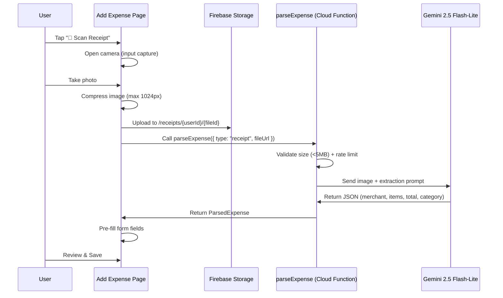
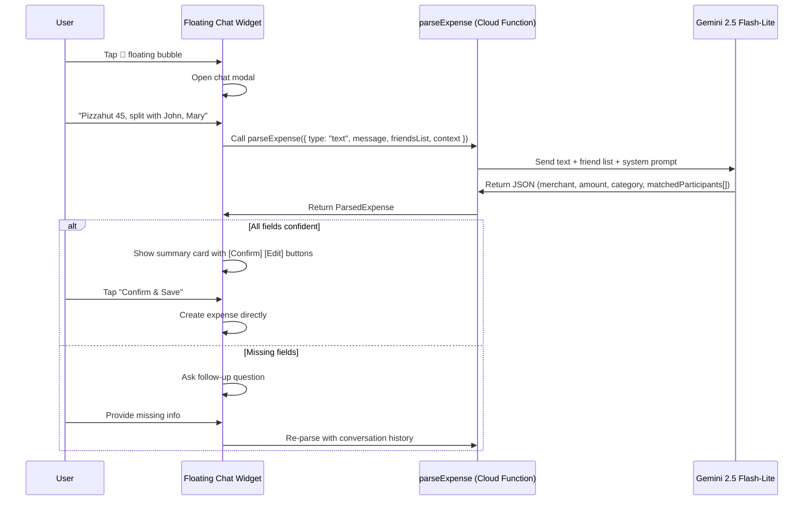

# Implementation Plan: Receipt Scanning & AI Expense Assistant

> **Phase 4** — Build on top of the existing Cloud Functions backend.

---

## Overview

Two complementary input methods for adding expenses — both powered by Gemini 2.5 Flash-Lite through a **unified** Cloud Function:

| Method | Input | How it works |
|:--|:--|:--|
| 📸 **Receipt Scan** | Camera photo | OCR → extract merchant, total, items, category → pre-fill form |
| 🤖 **AI Chat Assistant** | Natural language text | NLP → parse merchant, amount, category, participants → auto-fill or direct-save |

Both share the same `parseExpense` Cloud Function, Gemini prompt schema, and `ReceiptData` response type. The AI Assistant adds a **floating chat bubble** accessible from any page, with multi-turn conversation support.

---

## Architecture

### A. Receipt Scanning Flow



### B. AI Chat Assistant Flow



---

## Key Design Decisions

### 1. Unified `parseExpense` Cloud Function
Both receipt scanning and text parsing call the same function. Input type determines the Gemini prompt:
- `{ type: "receipt", fileUrl }` → image OCR mode
- `{ type: "text", message, friendsList, conversationHistory?, context? }` → NLP mode

This shares rate limiting, error handling, response schema, and category mapping.

### 2. Multi-Turn Conversation (AI Chat)
When Gemini can't extract all required fields, the bot asks follow-up questions instead of silently leaving fields blank:

> **User**: "Pizzahut 45, split with John"  
> **Bot**: "Got it! PizzaHut, $45, split with John. What category — Food, Entertainment, or Other?"  
> **User**: "Food"  
> **Bot**: "Here's your expense: ..." → [✅ Confirm] [✏️ Edit in Form]

Conversation history (last 5 messages) is sent with each request so Gemini has context.

### 3. Fuzzy Friend Matching via Gemini
The friend list (display names + UIDs only — **no emails/phones** for security) is included in the Gemini prompt. Gemini handles fuzzy matching natively:

> **User**: "Split with Jon"  
> **Bot**: "I couldn't find 'Jon' exactly. Did you mean **John Smith**?"

If no match is found, the bot tells the user and leaves the participant field empty for manual selection.

### 4. Multiple Input Formats
The Gemini prompt is designed to handle diverse natural language patterns:
- `"Pizzahut 45, split with John, Mary"` — explicit split
- `"Coffee 12.50"` — personal expense
- `"Uber 30, I paid for Trip to Bali group"` — group expense
- `"John owes me 20 for lunch"` — directional debt
- `"Split last night's dinner 120 equally between me, John, Mary, and Alex"`

### 5. Quick Action Buttons in Chat
After parsing, the bot renders an inline summary card:

```
🍕 PizzaHut — $45.00
📂 Category: Food
👥 Split with: John, Mary (Equal)

[✅ Confirm & Save]  [✏️ Edit in Form]  [❌ Cancel]
```

- **Confirm & Save** → creates the expense directly (no form needed)
- **Edit in Form** → navigates to Add Expense with fields pre-filled

### 6. Smart Defaults Based on Context
Context passed to Gemini for intelligent defaults:
- **Time-of-day**: Noon → default "Food"; evening → "Entertainment"
- **Currency**: User's locale currency
- **Recent contacts**: Prioritize frequently-split-with friends

### 7. Shared Rate Limiting
Receipt scans and chat messages share a combined daily quota stored in `users/{uid}/usage/{date}`:
- Receipt scans: count as 1 unit each
- Chat messages: count as 1 unit each
- Daily limit: 30 units total

---

## Proposed Changes

### Cloud Function

#### [NEW] [parseExpense.ts](file:///c:/Users/songz/projects/Smart%20Split/functions/src/parseExpense.ts)
- **Type**: Callable Function (`onCall`)
- **Input (Receipt mode)**:
  ```typescript
  { type: "receipt", fileUrl: string }
  ```
- **Input (Text/Chat mode)**:
  ```typescript
  {
    type: "text",
    message: string,
    friendsList: { uid: string, displayName: string }[],
    groupsList?: { id: string, name: string }[],
    conversationHistory?: { role: "user" | "assistant", content: string }[],
    context?: { timeOfDay: string, currency: string }
  }
  ```
- **Process**:
  1. Authenticate user via `context.auth`
  2. Rate limit: `users/{uid}/usage/{date}` — max 30 requests/day
  3. If `type === "receipt"`: download image from Storage, validate ≤5MB, build OCR prompt
  4. If `type === "text"`: build NLP prompt with friend/group list and conversation history
  5. Send to Gemini 2.5 Flash-Lite with structured output prompt:
     ```
     RECEIPT MODE:
     Extract: merchant, date (YYYY-MM-DD), items [{name, price}], total.
     Map category to: Food|Rental|Groceries|Entertainment|Beverage|Transportation|Utilities|Shopping|Travel|Other.
     Return JSON with confidence score 0-1.

     TEXT MODE:
     Parse the user's expense description. Extract: merchant/description, amount, category, 
     split participants (fuzzy match against provided friend list).
     If info is missing, set needsFollowUp: true and provide a followUpQuestion.
     Return JSON with matched participants [{ name, matchedUid, confidence }].
     ```
  6. Return `ParsedExpense` response
- **Error handling**: Low confidence → `"Could not parse"` with suggestion; rate exceeded → 429; timeout → retry

#### [MODIFY] [index.ts](file:///c:/Users/songz/projects/Smart%20Split/functions/src/index.ts)
- Add export: `export { parseExpense } from './parseExpense';`

---

### Storage Rules

#### [MODIFY] [storage.rules](file:///c:/Users/songz/projects/Smart%20Split/storage.rules)
- Add `/receipts/{userId}/{fileId}` path — read/write by owner only, max 5MB, image/* only

```diff
+match /receipts/{userId}/{fileId} {
+  allow read: if request.auth != null && request.auth.uid == userId;
+  allow write: if request.auth != null && request.auth.uid == userId
+               && request.resource.size < 5 * 1024 * 1024
+               && request.resource.contentType.matches('image/.*');
+}
```

---

### Types

#### [NEW] [receipt.ts](file:///c:/Users/songz/projects/Smart%20Split/src/types/receipt.ts)
```typescript
// Shared response from parseExpense Cloud Function
interface ParsedExpense {
  success: boolean;
  confidence: number;
  merchant?: string;
  date?: string;               // YYYY-MM-DD
  items?: { name: string; price: number }[];
  total?: number;
  currency?: string;
  category?: ExpenseCategory;
  participants?: MatchedParticipant[];
  splitType?: 'equal' | 'custom';
  needsFollowUp?: boolean;     // true if Gemini needs more info
  followUpQuestion?: string;   // question to ask user
  message?: string;            // error/warning
}

interface MatchedParticipant {
  inputName: string;           // what user typed ("Jon")
  matchedUid: string | null;   // matched friend UID or null
  matchedName: string | null;  // matched display name ("John Smith")
  confidence: number;          // 0-1 match confidence
}

// Chat message for conversation history
interface ChatMessage {
  id: string;
  role: 'user' | 'assistant';
  content: string;
  parsedExpense?: ParsedExpense;  // attached to bot messages with results
  timestamp: number;
}
```

---

### Client-Side Utilities

#### [NEW] [receiptScanner.ts](file:///c:/Users/songz/projects/Smart%20Split/src/utils/receiptScanner.ts)
- `compressImage(file, maxWidth=1024)` → client-side resize, returns Blob
- `uploadReceiptImage(userId, file)` → uploads to Storage `/receipts/{userId}/{uuid}`, returns URL
- `parseReceipt(fileUrl)` → calls `parseExpense({ type: "receipt", fileUrl })` via `httpsCallable`

#### [NEW] [aiAssistant.ts](file:///c:/Users/songz/projects/Smart%20Split/src/utils/aiAssistant.ts)
- `parseTextExpense(message, friendsList, groupsList, history?, context?)` → calls `parseExpense({ type: "text", ... })`
- `buildContext()` → returns `{ timeOfDay, currency }` for smart defaults
- `formatExpenseSummary(parsed)` → human-readable summary string for chat display

---

### Components

#### [NEW] [AIChatBubble.tsx](file:///c:/Users/songz/projects/Smart%20Split/src/components/AIChatBubble.tsx)
**Floating action button** — renders on all main pages (Friends, Groups, Activity, Dashboard):
- Fixed position: bottom-right corner, above the bottom nav bar, below the Add Expenses model for "Friends", "Group", "Account" page, and Dark and Light mode switching model for "Dashboard" page
- Animated 🤖 robot icon with subtle pulse animation
- `onClick` → opens `AIChatModal`
- Badge indicator when bot has a pending response

#### [NEW] [AIChatModal.tsx](file:///c:/Users/songz/projects/Smart%20Split/src/components/AIChatModal.tsx)
**Full-screen chat modal** with conversation UI:
- **Header**: "AI Expense Assistant" with close button
- **Message list**: scrollable chat bubbles (user = right/green, bot = left/gray)
- **Bot messages** include:
  - Text responses (follow-up questions, confirmations)
  - **Expense summary cards** with action buttons when parsing is successful
  - Typing indicator ("🤖 Thinking...") during Gemini API call
- **Input bar**: text input + send button at bottom
- **Action buttons** on parsed expense cards:
  - `✅ Confirm & Save` → calls `createExpense()` directly, shows success toast
  - `✏️ Edit in Form` → navigates to `/add-expense` with parsed data as URL params or context
  - `❌ Cancel` → dismisses the card
- **Conversation state**: maintains last 10 messages in local state (reset on close)
- **Suggested prompts**: shows example messages when chat is empty
  - "Coffee 8.50, split with Sarah"
  - "Uber 25, I paid for Weekend Trip group"
  - "John owes me 15 for lunch"

---

### Add Expense Page

#### [MODIFY] [page.tsx](file:///c:/Users/songz/projects/Smart%20Split/app/add-expense/page.tsx)
- Add **"📸 Scan Receipt"** button at top of form, also add a button of this in the AI chatbot as well
- Hidden `<input type="file" accept="image/*" capture="camera">`
- On capture: compress → upload → `parseReceipt()` → pre-fill amount, category, description
- **Read URL params** from AI chat: if navigated with `?prefill=...`, auto-populate fields
- Loading state: "Scanning receipt..." with spinner overlay
- Fallback: toast "Couldn't read receipt" → manual entry

**UI flow**:
1. User taps "📸 Scan Receipt" → native camera opens
2. Loading: "Scanning receipt..." with spinner
3. Success: form auto-fills with merchant (description), total (amount), category
4. User reviews, selects participants, saves
5. Error: toast message, user continues with manual entry

---

### Layout Integration

#### [MODIFY] [layout.tsx](file:///c:/Users/songz/projects/Smart%20Split/app/layout.tsx) or relevant layout file
- Import and render `<AIChatBubble />` globally (appears on pages with bottom nav)
- The bubble is hidden on `/add-expense` page (since the form is already there)

---

## PWA vs Native App Comparison

| | Receipt Scanning | AI Chat Assistant | QR Code Scanning |
|:--|:--|:--|:--|
| **PWA (now)** | ✅ Works **well** — `<input capture="camera">` opens camera, Gemini server-side. Same accuracy. Slightly less polished camera UX (file picker flashes) | ✅ Works **great** — text input, no hardware dependency. Identical on all platforms | ❌ Works **poorly** — web MediaStream API issues. Reverted. |
| **Native (Capacitor)** | ✅ Works **great** — `@capacitor/camera` opens instantly. Same server-side processing | ✅ Works **great** — identical to PWA | ✅ Works **great** — hardware-accelerated barcode scanner |
| **Difference** | **Minor** — cosmetic camera UX only | **None** — identical experience | **Major** — must wait for native |

---

## Dependencies

- `@google-cloud/vertexai` — already installed in `functions/`
- Vertex AI API — already enabled in `smart-split-9acc2`
- Firebase Storage — already configured
- No new npm packages required on client side

---

## Security Considerations

| Concern | Mitigation |
|:--|:--|
| Friend data sent to Gemini | Only `displayName` + `uid` — **never** emails, phones, or photos |
| Rate abuse | 30 requests/day per user (combined receipt + chat) |
| Prompt injection | System prompt instructs Gemini to only parse expenses, ignore other instructions |
| Image storage | Receipts stored under `/receipts/{userId}/` — owner-only access, auto-delete after 24h via lifecycle rule |
| Auth | Cloud Function validates `context.auth` — unauthenticated calls rejected |

---

## Verification Plan

### Cloud Function (Firebase Emulator)
```bash
cd functions && npm run build && firebase emulators:start --only functions,firestore,storage
```
- **Receipt mode**: `parseExpense({ type: "receipt", fileUrl })` with test image → verify JSON output
- **Text mode**: `parseExpense({ type: "text", message: "Pizzahut 45 split with John", friendsList: [...] })` → verify parsed output with matched participants
- **Fuzzy matching**: send "Jon" when friend list has "John Smith" → expect match with confidence
- **Follow-up flow**: send incomplete message "dinner 30" → expect `needsFollowUp: true` with question
- **Rate limiting**: 31st call → expect 429 error
- **Invalid image**: blurry/non-receipt → expect graceful error

### Manual Testing — Receipt Scanning
1. Add Expense → "📸 Scan Receipt" → take photo of receipt
2. Verify pre-fill: amount, category, description (merchant name)
3. Verify loading state and error handling (blurry image, no text)
4. Verify rate limit message after hitting daily limit
5. Verify receipt images stored in Firebase Storage under correct path

### Manual Testing — AI Chat Assistant
1. Tap 🤖 floating bubble → chat modal opens
2. Type "Pizzahut 45, split with John, Mary" → verify parsed summary card
3. Tap "Confirm & Save" → verify expense created in Firestore
4. Tap "Edit in Form" → verify navigation to Add Expense with pre-filled fields
5. Test follow-up flow: type "dinner 30" → bot asks for category → user replies → expense completes
6. Test fuzzy matching: type name with typo → bot suggests correct friend
7. Test unmatched name: type unknown name → bot reports no match, leaves participant blank
8. Test group expense: "Uber 25 for Weekend Trip group" → verify group detection
9. Test personal expense: "Coffee 5" → verify personal expense (no split)
10. Verify typing indicator appears while Gemini processes
11. Verify chat resets when modal is closed and reopened
