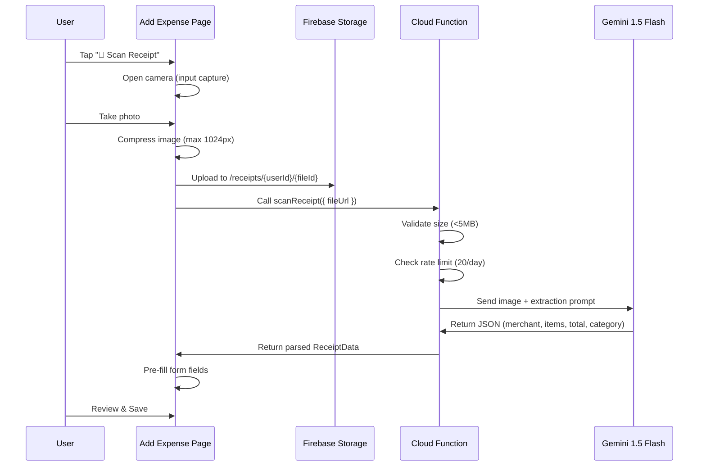

# Implementation Plan: Receipt Scanning (Features 2 & 3)

> **Next Phase** — Build on top of the existing Cloud Functions backend (Feature 1).

---

## Overview

**Splitwise approach**: Camera → upload → server OCR → pre-fill form → user reviews & saves.

Uses `<input type="file" accept="image/*" capture="camera">` which opens native camera on mobile browsers. This same HTML attribute also works inside Capacitor WebView — so the flow is identical on PWA and native app.

**PWA vs Native difference**: On PWA, the file picker dialog appears briefly before camera opens. On native app (after Capacitor + `@capacitor/camera`), the camera opens directly. The scanning accuracy is **identical** because Gemini processes the image server-side regardless of capture method. This is a cosmetic UX difference only.

---

## Architecture



---

## Proposed Changes

### Cloud Function

#### [NEW] [functions/src/scanReceipt.ts](file:///c:/Users/songz/projects/Smart%20Split/functions/src/scanReceipt.ts)
- **Type**: Callable Function (`onCall`)
- **Input**: `{ fileUrl: string }`
- **Process**:
  1. Download image from Firebase Storage
  2. Validate size (reject > 5MB)
  3. Rate limit: `users/{uid}/usage/{date}` — max 20 scans/day
  4. Send to Gemini 1.5 Flash:
     ```
     Extract: merchant, date (YYYY-MM-DD), items [{name, price}], total, currency.
     Map category to: Food|Groceries|Entertainment|Beverage|Transportation|Utilities|Shopping|Travel|Other.
     Return JSON with confidence score 0-1.
     ```
  5. Return parsed data or error
- **Error handling**: Low confidence → "Could not read receipt"; rate exceeded → 429; timeout → retry option

#### [MODIFY] [functions/src/index.ts](file:///c:/Users/songz/projects/Smart%20Split/functions/src/index.ts)
- Add export: `export { scanReceipt } from './scanReceipt';`

---

### Storage Rules

#### [MODIFY] [storage.rules](file:///c:/Users/songz/projects/Smart%20Split/storage.rules)
- Add `/receipts/{userId}/{fileId}` path — read/write by owner only, max 5MB, image/* only

```diff
+match /receipts/{userId}/{fileId} {
+  allow read: if request.auth != null && request.auth.uid == userId;
+  allow write: if request.auth != null && request.auth.uid == userId
+               && request.resource.size < 5 * 1024 * 1024
+               && request.resource.contentType.matches('image/.*');
+}
```

---

### Client-Side Utilities

#### [NEW] [src/utils/receiptScanner.ts](file:///c:/Users/songz/projects/Smart%20Split/src/utils/receiptScanner.ts)
- `uploadReceiptImage(userId, file)` → uploads to Storage, returns URL
- `scanReceipt(fileUrl)` → calls Cloud Function via `httpsCallable`
- `compressImage(file, maxWidth)` → client-side resize to 1024px

#### [NEW] [src/types/receipt.ts](file:///c:/Users/songz/projects/Smart%20Split/src/types/receipt.ts)
```typescript
interface ReceiptData {
  success: boolean;
  confidence: number;
  merchant?: string;
  date?: string;         // YYYY-MM-DD
  items?: { name: string; price: number }[];
  total?: number;
  currency?: string;
  category?: ExpenseCategory;
  message?: string;      // Error/warning message
}
```

---

### Add Expense Page

#### [MODIFY] [app/add-expense/page.tsx](file:///c:/Users/songz/projects/Smart%20Split/app/add-expense/page.tsx)
- Add **"📸 Scan Receipt"** button at top of form
- Hidden `<input type="file" accept="image/*" capture="camera">`
- On capture: compress → upload → scan → pre-fill amount, category, description
- Fallback: toast "Couldn't read receipt" → manual entry

**UI flow**:
1. User taps "📸 Scan Receipt" → native camera opens
2. Loading state: "Scanning receipt..." with spinner
3. Success: form auto-fills with merchant (description), total (amount), category
4. User reviews pre-filled data, selects split participants, saves
5. Error: toast message, user proceeds with manual entry

---

## PWA vs Native App Comparison

| | Receipt Scanning | QR Code Scanning |
|:--|:--|:--|
| **PWA (now)** | ✅ Works **well** — `<input capture="camera">` opens camera, image goes to Gemini server-side. Same accuracy as native. Just a slightly less polished camera UX (file picker flashes) | ❌ Works **poorly** — web MediaStream API gives low frame rate, bad autofocus, laggy detection. Previous attempt reverted. |
| **Native (Capacitor)** | ✅ Works **great** — `@capacitor/camera` opens camera instantly (no file picker). Same server-side Gemini processing. Polish upgrade only. | ✅ Works **great** — `capacitor-community/barcode-scanner` uses hardware-accelerated detection. Instant, reliable. |
| **Difference** | **Minor** — cosmetic camera UX only. Scanning accuracy identical. | **Major** — web QR is unusable for production. Must wait for native. |

---

## Dependencies

- `@google-cloud/vertexai` — already installed in `functions/`
- Vertex AI API — already enabled in `smart-split-9acc2`
- Firebase Storage — already configured

---

## Verification Plan

### Cloud Functions (Firebase Emulator)
```bash
cd functions && npm run build && firebase emulators:start --only functions,firestore,storage
```
- `scanReceipt` with test receipt image → verify JSON output
- Rate limiting: 21st call → expect 429 error
- Invalid image → expect graceful error

### Manual Testing
1. Add Expense → "📸 Scan Receipt" → take photo of receipt
2. Verify pre-fill: amount, category, description (merchant name)
3. Verify loading state and error handling (blurry image, no text)
4. Verify rate limit message after 20 scans in one day
5. Verify receipt images stored in Firebase Storage under correct path
