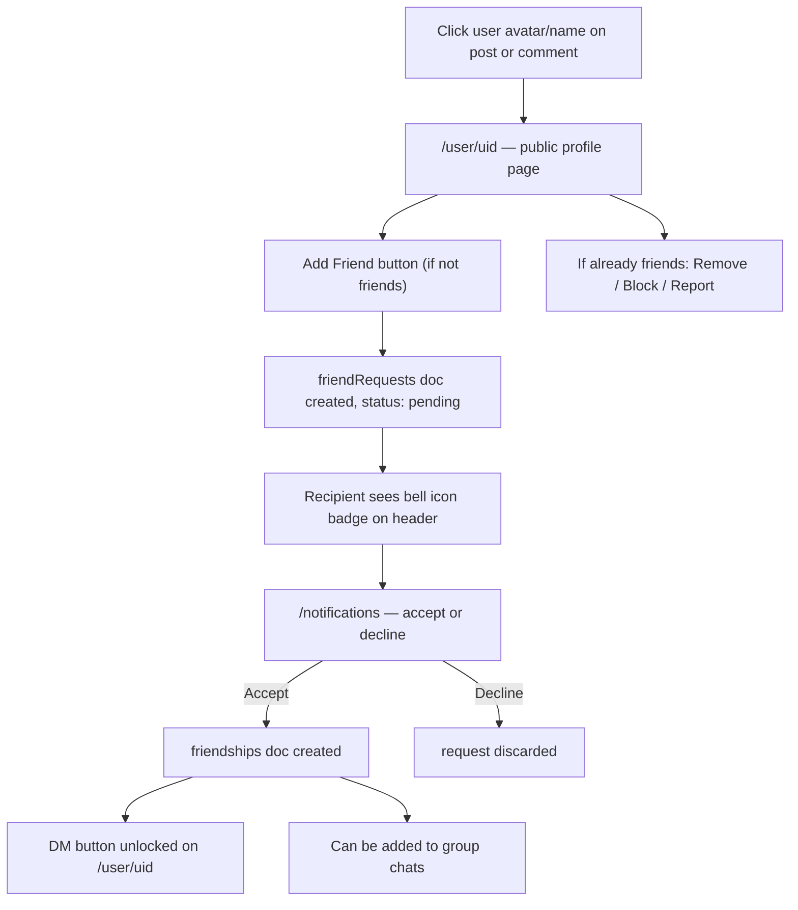

# Pin — Local Coordination Discussion PWA

## Concept

A lightweight forum where users post coordination requests (ride splits, bundle splits, group buys, etc.), comment to find co-participants, and then move private coordination into DMs or group chats. Real Google names and photos on every interaction serve as the trust mechanism before meeting up in person.

## Stack

Same as Smart Split and FanFan:
- Next.js 15 (App Router), TypeScript, Tailwind CSS, `next-pwa`
- Firebase Auth (Google Sign-In — real name + photo guaranteed)
- Cloud Firestore (real-time listeners for chat)
- Vercel deployment
- No GPS, no geo libraries

---

## Data Model (Firestore)

### Forum

**`posts` collection:**
```
{
  id,
  authorId, authorName, authorPhoto,
  header: string,                   // topic label, e.g. "Ride Share Cambridge"
  title: string,                    // one-line summary
  body: string,                     // markdown-lite (**bold**, _italic_)
  hashtags: string[],
  searchTokens: string[],           // mixed English/Chinese tokens for search
  visibility: "public" | "private",
  createdAt: Timestamp,
  commentCount: number
}
```

**`posts/{postId}/comments` subcollection:**
```
{
  id,
  authorId, authorName, authorPhoto,
  body,
  parentId: string | null,          // null = top-level, commentId = reply
  createdAt: Timestamp
}
```

**`users/{userId}/commentedPosts/{postId}`:**
```
{ postId, firstCommentedAt: Timestamp }
```

### Social

**`users/{userId}`:**
```
{ displayName, email, photoURL, createdAt }
```

**`friendRequests/{requestId}`:**
```
{
  fromId, fromName, fromPhoto,
  toId,
  status: "pending" | "accepted" | "declined",
  createdAt: Timestamp
}
```

**`friendships/{friendshipId}`:**
```
{
  userIds: [uid1, uid2],            // array-contains query for friend list
  createdAt: Timestamp
}
```

**`blocks/{blockerId}/blockedUsers/{blockedId}`:**
```
{ blockedAt: Timestamp }
```

**`reports/{reportId}`:**
```
{ reporterId, reportedUserId, reason, createdAt: Timestamp }
```

### Chat

**`chats/{chatId}`:**
```
{
  type: "dm" | "group",
  participantIds: string[],         // array-contains for querying user's chats
  groupName?: string,               // group chats only
  adminId?: string,                 // group creator
  lastMessage: string,
  lastMessageAt: Timestamp,
  createdAt: Timestamp
}
```

**`chats/{chatId}/messages/{messageId}`:**
```
{
  senderId, senderName, senderPhoto,
  body,
  createdAt: Timestamp
}
```

---

## Social & Chat Flow



---

## Search Strategy

Two modes detected by whether input starts with `#`:

**Hashtag mode** (`#ridesplitcambridge` or `#打车剑桥`):
- Query: `where("hashtags", "array-contains", tag)`
- Sorted by `createdAt` ascending (full history, oldest first)
- Public posts only

**Keyword mode** (`ride split cambridge` or `打车 剑桥` or mixed):
- Mixed tokenizer → `where("searchTokens", "array-contains-any", tokens)`
- Ranked client-side by match count
- Public posts only

### Mixed Tokenizer (English + Chinese)

```
tokenize("ride share 剑桥火车站")
→ ["ride", "share", "剑桥", "桥火", "火车", "车站"]
```

- English: split by spaces/punctuation, lowercase
- Chinese (Unicode `\u4e00-\u9fff`): generate consecutive bigrams
- Tokens built from: header + title + first 150 chars of body + hashtags
- Deduplicated; typical post produces 50–120 tokens

---

## App Structure

```
app/
├── page.tsx                       # Feed
├── post/
│   ├── new/page.tsx               # Create post
│   └── [id]/page.tsx              # Post detail + comments
├── user/
│   └── [userId]/page.tsx          # Public user profile
├── notifications/page.tsx         # Friend requests + system notifications
├── chat/
│   ├── page.tsx                   # Chat list (DMs + Groups)
│   ├── new-group/page.tsx         # Create group chat
│   └── [chatId]/page.tsx          # Chat conversation
├── profile/page.tsx               # My Posts + My Comments tabs
├── search/page.tsx                # Search
└── layout.tsx                     # Providers + BottomNav

src/
├── components/
│   ├── PostCard.tsx
│   ├── CommentItem.tsx
│   ├── CommentSection.tsx
│   ├── ChatListItem.tsx           # Preview row: avatar, name, last message, timestamp
│   ├── MessageBubble.tsx          # Sent/received chat bubble
│   └── BottomNav.tsx              # 5-tab navigation
├── hooks/
│   ├── useFeed.ts
│   ├── usePost.ts
│   ├── useComments.ts
│   ├── useFriends.ts              # friend list, requests, block
│   ├── useChats.ts                # chat list for current user
│   └── useMessages.ts             # real-time messages for a chat
├── services/
│   ├── PostService.ts
│   ├── CommentService.ts
│   ├── FriendService.ts           # sendRequest, accept, decline, remove, block, report
│   └── ChatService.ts             # createDM, createGroup, sendMessage, addMember
└── context/
    └── AuthContext.tsx
```

---

## Pages & Features

**Feed (`/`)** — Auth required
- All public posts sorted newest first, paginated
- PostCard: header badge, author photo + name (tappable → `/user/uid`), title, hashtag chips, posted time, comment count

**Create Post (`/post/new`)** — Auth required
- Header, Title, Body (B/I toolbar), Hashtags, Visibility toggle (Public default / Private)

**Post Detail (`/post/[id]`)**
- Header badge, markdown-rendered body, author (tappable → `/user/uid`)
- Delete button for post author
- Comments: avatars tappable → `/user/uid`, reply threading (2 levels), delete own comment

**User Profile (`/user/[userId]`)** — Auth required
- Shows: profile photo, display name, posts created by this user
- Action button states:
  - Not friends → "Add Friend" button
  - Request pending → "Pending..." (disabled)
  - Friends → "Message" button + three-dot menu (Remove Friend / Block / Report)
  - Blocked → "Unblock" only

**Notifications (`/notifications`)** — Accessible via bell icon in header
- Friend request cards: avatar, name, "Accept" / "Decline" buttons
- Bell icon in header shows red dot badge when there are pending requests

**Chat List (`/chat`)** — Auth required, friends only
- Two sections: Direct Messages and Groups
- Each row: avatar(s), name, last message preview, timestamp, unread count badge
- Floating "+" button → Create Group or start a DM by picking a friend

**Chat Conversation (`/chat/[chatId]`)**
- Header: name/avatar, group member count for groups
- Real-time messages via Firestore listener
- Message bubbles: own messages right-aligned (purple), others left-aligned (white)
- Group chats show sender name above each bubble
- Group admin sees "Add Member" and "Remove Member" options

**Create Group (`/chat/new-group`)**
- Name the group
- Pick friends from friend list to add (multi-select)
- Creator becomes admin

**Profile (`/profile`)** — Auth required
- Account row: display name, email, Sign Out
- Two tabs: My Posts (with delete) / My Comments

**Search (`/search`)**
- `#hashtag` or keyword mode, English + Chinese
- Trending hashtags, recent searches

---

## Bottom Navigation (5 tabs)

| Tab | Route | Badge |
|-----|-------|-------|
| Feed | `/` | — |
| Post | `/post/new` | — |
| Search | `/search` | — |
| Chat | `/chat` | Unread message count |
| Profile | `/profile` | — |

Bell icon in top-right of header → `/notifications` (friend requests badge)

---

## Visibility

- `public` — surfaces in feed and search
- `private` — direct URL only, shareable via link

---

## Key Dependencies

```json
"firebase": "^12.x",
"next": "^15.x",
"next-pwa": "^5.x",
"vaul": "^1.x",
"react-markdown": "^9.x",
"tailwindcss": "^3.x"
```

---

## Firestore Security Rules

```
// Posts
match /posts/{postId} {
  allow read: if resource.data.visibility == "public"
               || request.auth.uid == resource.data.authorId;
  allow create: if request.auth != null;
  allow delete: if request.auth.uid == resource.data.authorId;
}
match /posts/{postId}/comments/{commentId} {
  allow read, create: if request.auth != null;
  allow delete: if request.auth.uid == resource.data.authorId;
}

// Social
match /friendRequests/{requestId} {
  allow read: if request.auth.uid == resource.data.fromId
               || request.auth.uid == resource.data.toId;
  allow create: if request.auth.uid == request.resource.data.fromId;
  allow update: if request.auth.uid == resource.data.toId; // accept/decline
  allow delete: if request.auth.uid == resource.data.fromId; // cancel
}
match /friendships/{friendshipId} {
  allow read: if request.auth.uid in resource.data.userIds;
  allow create, delete: if request.auth.uid in resource.data.userIds;
}
match /blocks/{blockerId}/blockedUsers/{blockedId} {
  allow read, write: if request.auth.uid == blockerId;
}

// Chat
match /chats/{chatId} {
  allow read: if request.auth.uid in resource.data.participantIds;
  allow create: if request.auth.uid in request.resource.data.participantIds;
  allow update: if request.auth.uid == resource.data.adminId; // group admin only
}
match /chats/{chatId}/messages/{messageId} {
  allow read: if request.auth.uid in get(/databases/$(database)/documents/chats/$(chatId)).data.participantIds;
  allow create: if request.auth.uid == request.resource.data.senderId
                 && request.auth.uid in get(/databases/$(database)/documents/chats/$(chatId)).data.participantIds;
}

// Users
match /users/{userId}/commentedPosts/{postId} {
  allow read, write: if request.auth.uid == userId;
}
```

