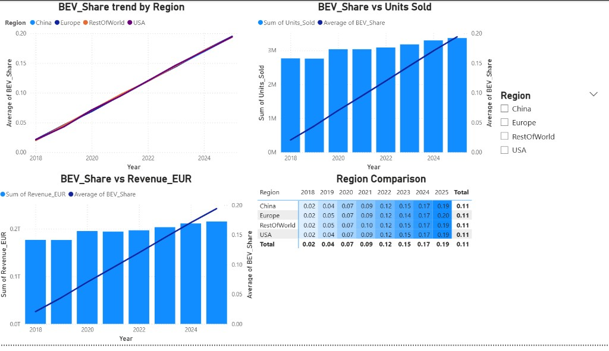
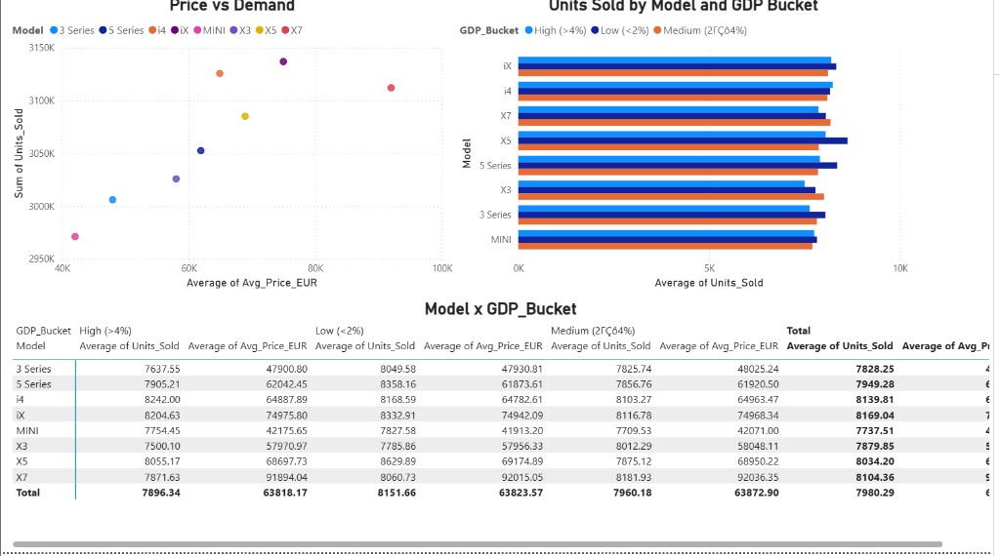
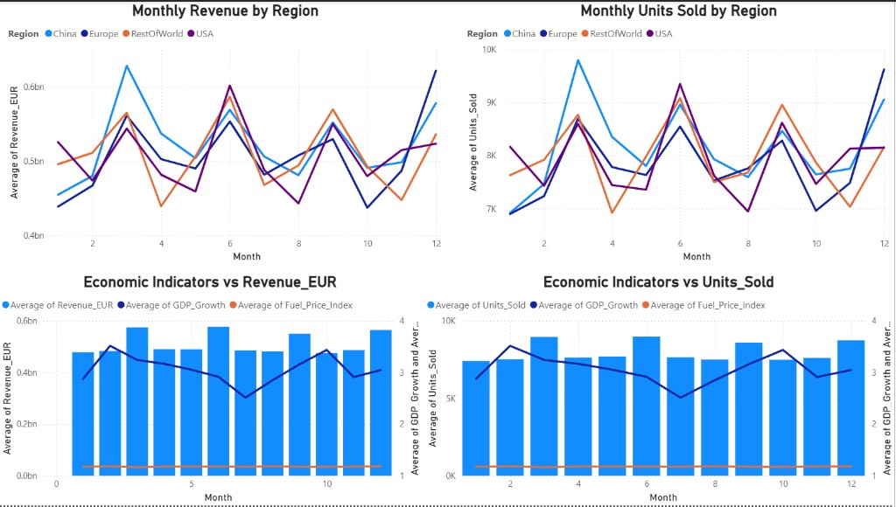

# Solume Coding Review — Zi Song Yeoh

Submission for the Solume Medical coding assessment (deadline: 27 March 2026, 9:00 Sydney time).

## Structure


| Folder       | Section               | Description                                              |
| ------------ | --------------------- | -------------------------------------------------------- |
| `section-a/` | Section A (Q A, B, C) | BMW Global Sales data analysis — Power BI (.pbix)        |
| `section-b/` | Section B             | Tree LCA kawaiiness algorithm — Python                   |
| `section-c/` | Section C             | CMS Dialysis Mortality full-stack app — Next.js + Vercel |


---

## Section A — Data Analysis (Power BI)

**Dataset:** `BMW_global_sales_2018-2025.zip` → `bmw_global_sales_2018_2025.csv`

Open `section-a/bmw_analysis.pbix` in Power BI Desktop.

---

### Questions Answered

**Question A**

> How does BEV_Share growth over time (2018–2025) correlate with Units_Sold and Revenue_EUR across different regions, and which region shows the strongest transition toward electrification?

**Question B**

> Which models demonstrate the highest price elasticity, based on changes in Avg_Price_EUR vs Units_Sold, and how does this vary across economic conditions (GDP_Growth levels)?

**Question C**

> Can we identify seasonal patterns (Month-level trends) in Revenue_EUR and Units_Sold, and do these patterns interact differently with regional economic indicators (GDP_Growth, Fuel_Price_Index)?

---

### How It Was Built

#### Step 1 — Power Query: Data Cleaning

Three fixes applied before loading the data:

- **Negative BEV_Share clamped to 0** — 9 rows had invalid negative values; replaced with 0 using a custom column
- **Pre-launch i4/iX rows flagged** — 288 rows for i4/iX models before 2021 (pre-launch noise) were tagged with a `DataQualityFlag = "Pre-launch noise"` column; all analysis pages filter these out
- **Column types corrected** — Year/Month as Whole Number, BEV_Share/GDP_Growth as Decimal, etc.

#### Step 2 — Calculated Column

A `GDP_Bucket` column was created in DAX to group economic conditions:

```
GDP_Bucket =
IF([GDP_Growth] < 2, "Low (<2%)",
   IF([GDP_Growth] <= 4, "Medium (2–4%)",
   "High (>4%)"))
```

#### Step 3 — Pages Built


| Page                 | Content                                                                                                                    |
| -------------------- | -------------------------------------------------------------------------------------------------------------------------- |
| **1 – Question A**   | BEV trend line, BEV vs Units_Sold, BEV vs Revenue_EUR, Region comparison matrix with conditional formatting                |
| **2 – Question B**   | Price vs Demand scatter (all years), Units Sold by Model & GDP Bucket bar chart, Model × GDP_Bucket matrix                 |
| **3 – Question C**   | Monthly Revenue by Region, Monthly Units Sold by Region, Economic Indicators vs Revenue, Economic Indicators vs Units_Sold |


---

### Key Findings

**Question A:** All 4 regions (China, Europe, RestOfWorld, USA) follow a near-identical BEV_Share growth trajectory from 0.02 (2018) to ~0.19–0.20 (2025). Europe leads marginally at 0.20. The uniform growth across regions indicates a globally coordinated electrification strategy rather than a region-led shift. BEV_Share growth correlates positively with both Units_Sold growth and Revenue_EUR growth.



**Question B:** iX and X7 are the highest-priced models with the lowest unit volumes — showing the strongest negative price elasticity signal. Demand across all models responds noticeably to GDP conditions, with High GDP environments generally supporting higher average units sold, particularly for premium models (iX, i4, X7).



**Question C:** Clear seasonal peaks at months 3–4 (spring) and 11–12 (year-end) across all regions and both Revenue_EUR and Units_Sold. GDP_Growth loosely aligns with these cycles. Fuel_Price_Index shows minimal monthly variation and does not drive the seasonal pattern — the peaks are explained by consumer buying cycles (Q1 registrations and Q4 year-end deals) rather than fuel cost fluctuations.



---

## Section B — Algorithm (Python)

### Problem

Given a tree with `n` nodes and integer `k`, compute the **kawaiiness** — the sum over all possible roots `r` of `f(r)`, where `f(r)` is the number of distinct nodes that can appear as the Lowest Common Ancestor (LCA) of some set of `k` nodes when the tree is rooted at `r`.

### How to Run

Inline input:

```bash
echo "1
6 3
1 2
1 3
2 4
2 5
3 6" | python solution.py
# Expected output: 17
```

**Requirements:** Python 3.7+, no external libraries.

### Algorithm

**Key insight:** For a fixed root `r`, a node `v` can be the LCA of some `k`-node subset if and only if its subtree size (when rooted at `r`) is ≥ `k`. Proof: include `v` itself in the set plus any `k−1` descendants — the LCA is always `v`.

So: `f(r) = |{v : subtree_size_r(v) >= k}|`

**Rerooting in O(n):** Root the tree at node 1. For each node `v` with subtree size `sub[v]`, count roots `r` where `subtree_size_r(v) >= k`:


| Root `r` location       | subtree_size_r(v) | Count        | Contributes if    |
| ----------------------- | ----------------- | ------------ | ----------------- |
| Outside `sub[v]`        | `sub[v]`          | `n − sub[v]` | `sub[v] >= k`     |
| `r = v`                 | `n`               | `1`          | always            |
| Inside child `c` of `v` | `n − sub[c]`      | `sub[c]`     | `n − sub[c] >= k` |


**Total per node v:** `[sub[v]>=k]*(n−sub[v]) + 1 + Σ_children_c [n−sub[c]>=k]*sub[c]`

**Time complexity:** O(n) per test case. Uses iterative DFS to avoid Python's recursion limit.

### Verified Examples


| Input           | Expected | Got  |
| --------------- | -------- | ---- |
| n=2, k=2        | 2        | ✓ 2  |
| n=5, k=3 (star) | 9        | ✓ 9  |
| n=6, k=3        | 17       | ✓ 17 |
| n=10, k=5       | 35       | ✓ 35 |


---

## Section C — Full-Stack Application (Next.js)

**Live URL:** [https://section-c-xi.vercel.app](https://section-c-xi.vercel.app)

A full-stack web application for analysing CMS dialysis facility mortality rates across the United States.

### Run Locally

No environment variables required — all data is fetched from the public CMS API.

```bash
cd section-c
npm install
npm run dev
```

Open [http://localhost:3000](http://localhost:3000).

---

### How It Was Built

#### Backend

- **API routes** built with Next.js App Router (`/app/api/`), deployed as serverless functions on Vercel
- **Data source**: CMS public REST API (`data.cms.gov`) — 7,557 dialysis facilities fetched in paginated batches of 1,000
- **In-memory cache**: module-level cache with 1-hour TTL means the CMS API is called at most once per hour per server instance, not on every request. Have **AbortController** to cancel old requests
- **Filtering**: all 5 filter params (`year`, `month`, `state`, `zip`, `name`) applied server-side via `filterFacilities()` — ZIP uses prefix matching, name uses case-insensitive substring match
- **Aggregations**: mean, min, max, std dev, outlier threshold (mean + 2×std dev), grouping by state/ZIP/cert era/distribution buckets — all computed in a single pass over the filtered dataset
- **Edge cases handled**: empty `mortality_rate_facility` strings treated as null and excluded from all aggregations; missing cert dates handled gracefully; invalid numeric values (NaN) filtered out

#### Frontend

- **Framework**: Next.js 15 App Router, TypeScript, Tailwind CSS
- **State management**: filter state held in React `useState` — `filterString` derived value passed as `useEffect` dependency triggers re-fetch automatically on any filter change; `AbortController` used to cancel stale in-flight requests
- **Charts**: Recharts — `LineChart`, `BarChart`, `ComposedChart`, `ResponsiveContainer`; dual y-axis used where metrics have different scales
- **Responsive to filters**: all charts, cards, tables and the export re-query the API on every filter change with no page reload

#### Pages

**Page 1 — Summary (`/`)**

- Filters: Year, Month, State, ZIP code (prefix match), Facility Name (search)
- Stats cards: total facilities, average / min / max mortality rate
- Top 10 Highest & Lowest mortality facilities in the filtered set
- Full paginated table — 20 rows per page, sorted by mortality descending
- Export CSV — downloads all filtered results as a `.csv` file

**Page 2 — Analysis (`/analysis`)**

- Mortality Rate Trend by Facility Certification Era — dual y-axis line chart
- State comparison bar chart with national average reference line
- Multi-state side-by-side selector — click state badges to compare
- ZIP code comparison — horizontal bar chart, top ZIP codes by avg mortality
- Distribution histogram — mortality buckets with outlier zones highlighted
- Facility ranking table — sorted by avg mortality, shows diff vs national avg

#### API Endpoints

All endpoints accept: `?year=&month=&state=&zip=&name=`


| Endpoint                            | Returns                                                                                                    |
| ----------------------------------- | ---------------------------------------------------------------------------------------------------------- |
| `GET /api/summary`                  | `{ total, avgMortality, minMortality, maxMortality, stdDev, outlierThreshold, top10Highest, top10Lowest }` |
| `GET /api/table?page=1&pageSize=20` | `{ data[], page, pageSize, total }`                                                                        |
| `GET /api/analysis`                 | `{ monthlyTrend[], byCertEra[], byState[], byZip[], distribution[], nationalAvg }`                         |


---

### Architectural Decisions

**Why in-memory caching instead of fetching on every request?**
The CMS dataset (`data.cms.gov`) is a public REST API with no authentication and rate limits. Fetching all 7,557 facilities requires ~8 paginated requests of 1,000 rows each. Doing this on every user request would make the app unusably slow (seconds of latency per click) and risk hitting CMS rate limits under any real traffic. The solution is a module-level cache in `cmsData.ts` — on the first request, all pages are fetched and stored in memory. Every subsequent request within 1 hour reads from that in-memory array instantly. After 1 hour the cache expires and refreshes, ensuring data stays reasonably current without polling. This is the simplest correct solution for a read-only dataset of this size.

**Why are empty `mortality_rate_facility` strings treated as null?**
The raw CMS API returns `mortality_rate_facility` as a string field. For facilities where the SMR has not been calculated (too few patients, new facility, data suppressed for privacy), the field is an empty string `""` rather than a missing key or a JSON `null`. If these were parsed as `0` or included as-is, they would corrupt every aggregation — the average mortality, min/max, standard deviation, and outlier threshold would all be dragged down toward zero by facilities that simply have no reported data. Treating `""` as null and excluding those records from aggregations ensures all computed statistics reflect only facilities with actual measured mortality rates.

**Why do the Year and Month filters use `certification_date` instead of `smr_date`?**
`smr_date` (e.g. `"01Jan2021-31Dec2024"`) represents the measurement window — the 3-year rolling period over which the SMR was calculated. Every facility in the current dataset shares the same or very similar `smr_date` range, so filtering by it would either return everything or nothing and would not be meaningful to users. `certification_date` (e.g. `"2015-03-15"`) is the date each facility was certified by CMS and varies across all facilities from 1968 to 2025. This is the only date field that meaningfully differs between records and allows users to explore how mortality patterns vary by facility age/era — which is also what drives the "Mortality Rate Trend by Facility Era" chart on the Analysis page.

---


